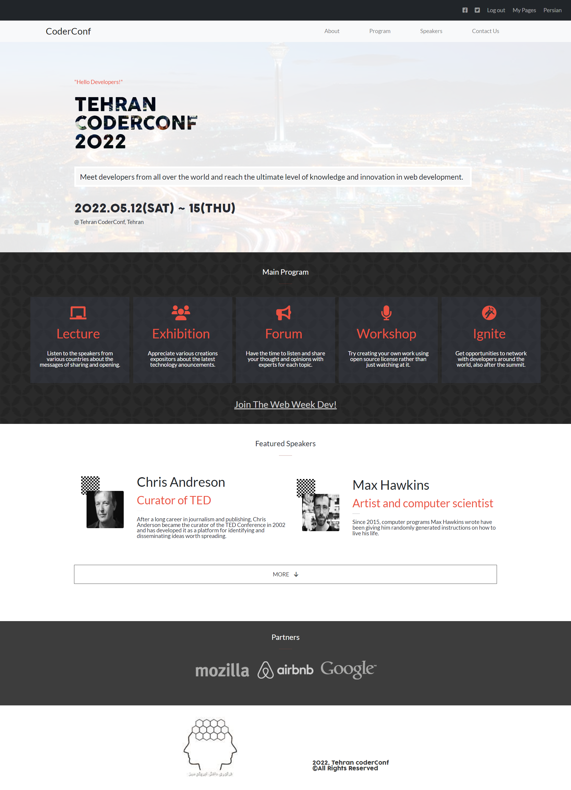

# Portfolio

> This is Tehran Coders Conf website template that contains: events, guests and sponsors.

## Live Demo

[Live Demo Link](https://beyk.github.io/codersconf/)

## Built With

- HTML
- CSS
- Javascript
- VSCode
- Linters

## Authors

👤 **Beyk**

- GitHub: [@mirouhml](https://github.com/beyk)
- LinkedIn: [LinkedIn](https://www.linkedin.com/in/asghar-beykmohammadi-1b16b291/)
- Twitter: [@kuronomirou](https://twitter.com/beyk_a)

## Design 

- Original design idea by [Cindy Shin in Behance](https://www.behance.net/adagio07) 
- [Design Guideline](https://www.behance.net/gallery/29845175/CC-Global-Summit-2015) 

## 🤝 Contributing

Contributions, issues, and feature requests are welcome!

Feel free to check the [issues page](#).

## Show your support

Give a ⭐️ if you like this project!

## 📝 License

This project is [MIT](./MIT.md) licensed.

